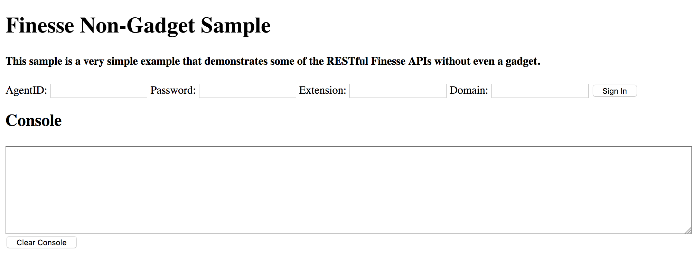

# Cisco Finesse - Non-Gadget Sample
The non-gadget sample presents a web page allowing the ability to sign in/out, query for and change agent state, and perform basic call control operations. The example page implements the logic to connect to a BOSH/XMPP server using the [Cisco Ajax XMPP Library](http://developer.cisco.com/site/im-and-presence) to receive events. All responses and events will simply print to the debugger console. The code has been tested with Firefox 3.2.0 ESR with Firebug 2.0.14 and Internet Explorer 11.



This sample contains the following files:

	_readme.txt
    httpd.conf
    index.html
    resources/
    	js/
        	finessenongadget.js
            jabberwerx.js
            jquery-1.9.1.min.js
            sample.js
	Sample.pdf

Download the version of the sample gadget that matches the Finesse version. Starting Finesse 11.0(1), sample gadgets will be forward compatible until compatibility is broken. At that time, a new version of the sample gadget will be published with the starting Finesse version number in the filename.

## Requirements
1. The sample gadget and the Finesse JavaScript library requires a deployment that includes Cisco Finesse. If you do not have a system that includes Cisco Finesse, you can reserve a [DevNet sandbox](https://developer.cisco.com/docs/finesse/#!sandbox) for developing your gadget.
1. jQuery: This code requires the jQuery JavaScript library to be imported. The library is used to simplify client-side scripting of the DOM and used to make Ajax requests. The HTML page currently uses jQuery 1.9.1.
1. XMPP Library: [Cisco Ajax XMPP Library](http://developer.cisco.com/site/im-and-presence) (also known as JabberWerx) is the XMPP library used to connect to the Notification Service to receive events. The sample page depends on the library be imported. Developers can have a choice of using this library or utilizing their own.

## Usage
Developers who wish to use the sample page should be aware of the same-origin policy. A page loaded in a browser can only make Ajax requests to the server which is hosting the original web content. Since the sample page is loading from a webserver outside of the Cisco Finesse server, the page cannot make direct Ajax request to the Web Service or Notification Service. A common deployment solution is to set up a HTTP proxy on the developer web server which can proxy all BOSH connections and HTTP request to the Cisco Finesse server.

The following is an example of configuring the Apache Web Server as a proxy. Note that this information is provided **AS IS**. Cisco will not provide assistance setting up your Apache web server.

1. Read the document Sample.pdf for an overview about this sample code as well as step-by-step instructions on how to use this sample.
2. Create a reverse proxy URL on your web server to point to the appropriate Cisco Finesse host and port.
```
 '/finesse' ==> 'http://host:8082/finesse'
 '/http-bind/' ==> 'http://host:7071/http-bind/'
```
To do so, add the following entry in the main Apache config file httpd.conf for forwarding both BOSH and Web Service requests:
```
ProxyPass /finesse http://host:8082/finesse
ProxyPass /http-bind/ http://host:7071/http-bind/ keepalive=On
disablereuse=Off
ProxyPassReverse /http-bind http://10.86.139.39:7071/http-bind/
```
3. Also in httpd.conf, enable the following modules.
```
LoadModule proxy_module modules/mod_proxy.so
LoadModule proxy_http_module modules/mod_proxy_http.so
LoadModule rewrite_module modules/mod_rewrite.so
```
4. Create the proxy info
```
<Proxy *>
Order Deny,Allow
#Deny from all
Allow from <finesse server>
Allow from <proxy server>
</Proxy>
```
5. Restart the Apache server for the changes to take effect.

**Note**: Included with the sample code is a sample Apache config file httpd.conf. It is intended as a sample only. Cisco will **NOT** provide support in configuring your proxy server.

## Additional Information
##### Finesse REST API
Documentation for the Finesse REST API can be found in the [Finesse Developer Guide](https://developer.cisco.com/docs/finesse/#!rest-api-dev-guide).

## Disclaimer
This sample code is only a sample and is **NOT guaranteed to be bug free and production quality**.

The sample code is meant to:
- Serve as an example of the step by step process of building a web page that is not a gadget using the Finesse REST APIs.
- Provided as a guide for a developer to see how to use the Cisco Ajax XMPP Library and
jQuery to make Finesse REST API requests and process the Finesse notifications.

## Support Notice
[Support](https://developer.cisco.com/site/support) for the sample code is provided on a "best effort" basis via DevNet. Like any custom deployment, it is the responsibility of the partner and/or customer to ensure that the customization works correctly and this includes ensuring that the sample code is properly integrated into 3rd party applications.

Cisco Systems, Inc.<br>
[http://www.cisco.com](http://www.cisco.com)<br>
[http://developer.cisco.com/site/finesse](http://developer.cisco.com/site/finesse)