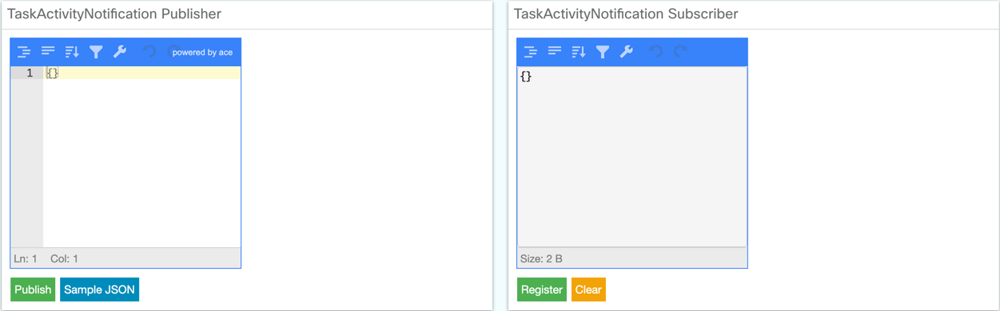

# Cisco Finesse - Task Activity Notification Sample Gadget

The task activity notification sample gadget illustrates the usage of Finesse APIs for notifying and receiving updates about digital task activity status. It primarily provides a way for Task Management gadgets to inform the desktop and other subscribers about which tasks are currently active / inactive.



This sample gadget contains the following files:

	README.md
	TaskActivityNotification/
    	img/
        	jsoneditor-icons.svg
    	jsoneditor.min.css
    	jsoneditor.min.js
		TaskActivityNotificationGadget.js
		TaskActivityNotificationPublisher.xml
		TaskActivityNotificationSubscriber.xml

Download the version of the sample gadget that matches the Finesse version. Starting Finesse 11.0(1), sample gadgets will be forward compatible until compatibility is broken. At that time, a new version of the sample gadget will be published with the starting Finesse version number in the filename.

TaskActivityNotificationSampleGadget-Finesse-12.6.1-v1.0.zip supports notification updates with the digital task activity status. Supported in finesse v12.6.1 and higher.

## Requirements
1. The sample gadget and the Finesse JavaScript library requires a deployment that includes Cisco Finesse. If you do not have a system that includes Cisco Finesse, you can reserve a [DevNet sandbox](https://developer.cisco.com/docs/finesse/#!sandbox) for developing your gadget.

## Usage
If configuring the gadget to run within the Finesse desktop:
1. Place contents from TaskActivityNotification folder into the 3rdpartygadget directory in Finesse.
2. Add the gadget to the desktop layout under the desired role (Agent, Supervisor).

 See the "Third Party Gadgets" chapter in the [Finesse Developer Guide](https://developer.cisco.com/docs/finesse/#!rest-api-dev-guide) and the "Manage Third-Party Gadgets" chapter in the [Finesse Administration Guide](http://www.cisco.com/c/en/us/support/customer-collaboration/finesse/products-user-guide-list.html) for more information about uploading third-party gadgets and adding them to the desktop.

### TaskActivityNotification Publisher Gadget
This gadget is used to publish/notify updates about digital task activity status to subscribers gadgets.

This represent:

```
taskActivityNotification = window.finesse.containerservices.TaskActivityNotification.init(containerServices);

// Publish task
taskActivityNotification.notifyTaskSelection(from, message);
```

Sample Example:

```
{
	"from" : "gadget_id",
	"message": {
		"taskId" : "task_id_1",
		"active" : true,
		"mediaType" : "Twitter",
		"timestamp" : 1590419765310 // Date.now()
		"contextInfo" : {
			"twitter_account" : "xyz"
		}
	}
}
```

-  `timestamp` and `contextInfo` are optional fields.
- On click of `Publish` button, JSON payload will be notified to subscriber gadgets.
- On click of `Sample JSON` button, sample JSON will be added to Editor.

### TaskActivityNotification Subscriber Gadget
This gadget is used to receive published digital task activity status.

* Subscribe using callback.
* Request for last task from all the Notifier gadgets.

This represents:

```
taskActivityNotification = window.finesse.containerservices.TaskActivityNotification.init(containerServices);

// subscribe for task
taskActivityNotification.registerForTaskNotifications(callbackFunction);

// request for tasks
taskActivityNotification.requestCurrentTasks()
```

* On click of `Register` button, gadget will register a callback for tasks.
* On click of `Request Tasks` button, gadget will receive last task from notifier gadgets.
* On click of `Clear` button, clear the Editor.

**Note:** Both the sample gadgets `TaskActivityNotificationPublisher.xml` and `TaskActivityNotificationSubscriber.xml` need to be deployed.

## Additional Information
##### Finesse REST API
Documentation for the Finesse REST API can be found in the [Finesse Developer Guide](https://developer.cisco.com/docs/finesse/#!rest-api-dev-guide).

##### Finesse JavaScript Library
Documentation for the Finesse JavaScript library can be found on [DevNet](https://developer.cisco.com/docs/finesse/#!javascript-library) and is also located on the Finesse server at the following URL: http(s)://&lt;FQDN&gt;:&lt;port&gt;/desktop/assets/js/doc/index.html

- You can access the JavaScript library at the following URL (starting Finesse 10.6(1)): http(s)://&lt;FQDN&gt;:&lt;port&gt;/desktop/assets/js/finesse.js.

 If you have third-party gadgets, the third-party gadgets can access the JavaScript library at: /desktop/assets/js/finesse.js.

- You can access JQuery at the following URL (starting Finesse 10.6(1)): http(s)://&lt;FQDN&gt;:&lt;port&gt;/desktop/assets/js/jquery.min.js.

 If you have third-party gadgets, the third-party gadgets can access JQuery at: /desktop/assets/js/jquery.min.js.

**For proper functioning of the JavaScript library, you must import both the JavaScript library and JQuery.**

## Disclaimer
This gadget is only a sample and is **NOT guaranteed to be bug free and production quality**.

The sample gadgets are meant to:
- Illustrate how to use the Finesse REST and JavaScript APIs
- Serve as an example of the step by step process of building a gadget using the Finesse JavaScript Library
- Provided as a guide for a developer to see how to initialize a gadget and set up handlers for user and dialog updates.

## Support Notice
[Support](https://developer.cisco.com/support) for the JavaScript library is provided on a "best effort" basis via DevNet. Like any custom deployment, it is the responsibility of the partner and/or customer to ensure that the customization works correctly and this includes ensuring that the Cisco Finesse JavaScript is properly integrated into 3rd party applications. Cisco reserves the right to make changes to the JavaScript code and corresponding API as part of the normal Cisco Finesse release cycle.

It is Cisco's intention to ensure JavaScript compatibility across versions as much as possible and Cisco will make every effort to clearly document any differences in the JavaScript across versions in the event that a backwards compatibility impacting change is made.

Cisco Systems, Inc.<br>
[http://www.cisco.com](http://www.cisco.com)<br>
[http://developer.cisco.com/site/finesse](http://developer.cisco.com/site/finesse)