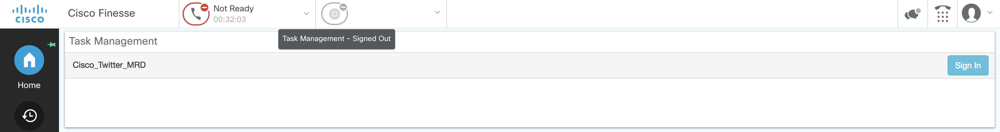
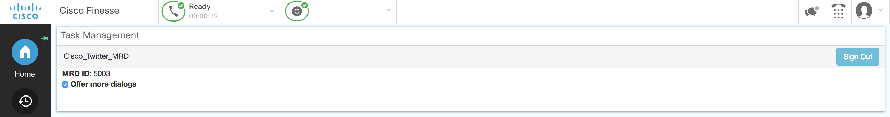
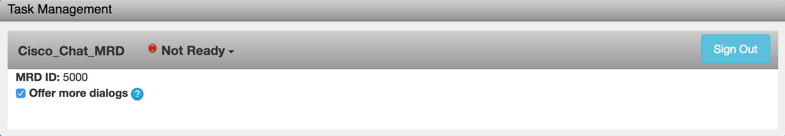

# Cisco Finesse - Task Management Sample Gadget

The task management sample gadget demonstrates the following functionality:
1. Logging into a Media Routing Domain (MRD)
2. Changing state in an MRD
3. Logging out of an MRD
4. Accept and interact with dialogs
5. Signal the Customer Context gadget to display PODs

Version 12.0.1-v1.0



Version 11.5.1-v1.0


This sample gadget contains the following files:

	TaskManagementGadget/
    	images/
        	help.png
        	sprite_presence.png
        script-selectors.txt
    	tabpanel.js
		TaskManagementGadget.css
		TaskManagementGadget.js
		TaskManagementGadget.xml
        test-Messages.xml
	_readme.txt

Download the version of the sample gadget that matches the Finesse version. Starting Finesse 11.0(1), sample gadgets will be forward compatible until compatibility is broken. At that time, a new version of the sample gadget will be published with the starting Finesse version number in the filename.

TaskManagementSampleGadget-Finesse-12.0.1-v1.0.zip supports state management with digital channel service. Supported in finesse v12.01 and higher.

## Requirements
1. The sample gadget and the Finesse JavaScript library requires a deployment that includes Cisco Finesse. If you do not have a system that includes Cisco Finesse, you can reserve a [DevNet sandbox](https://developer.cisco.com/docs/finesse/#!sandbox) for developing your gadget.
1. The system must be configured to support the Task Routing API before using this gadget.
2. Follow the section on Task Routing in the Features Guide for step by step instructions on how to do this.

## Usage
If configuring the gadget to run within the Finesse desktop:
1. Place contents from TaskManagementGadget folder into the 3rdpartygadget directory in Finesse.
2. Add the gadget to the desktop layout under the desired role (Agent, Supervisor) with the query params mrdid, mrdname, maxdialogs, interruptAction, and dialogLogoutAction.

 Here is an example of valid XML for this gadget:
```xml
<gadget>/3rdpartygadget/files/TaskManagementGadget.xml?mrdid=5000&mrdname=TestMRD1&maxdialogs=3&interruptAction=ACCEPT&dialogLogoutAction=CLOSE</gadget>
```

 See the "Third Party Gadgets" chapter in the [Finesse Developer Guide](https://developer.cisco.com/docs/finesse/#!rest-api-dev-guide) and the "Manage Third-Party Gadgets" chapter in the [Finesse Administration Guide](http://www.cisco.com/c/en/us/support/customer-collaboration/finesse/products-user-guide-list.html) for more information about uploading third-party gadgets and adding them to the desktop.

If configuring the gadget to run from an external web server:
1. Upload the gadget files to the web server and configure it to run this gadget as you would for any other web page.
2. You will need to change the relative paths to local Finesse files to point to your Finesse server in TaskManagementGadget.xml:
```xml
<link rel="stylesheet" href="/desktop/thirdparty/bootstrap/3.2.0/css/bootstrap.css" type="text/css"></link>
<!-- jQuery -->
<script type="text/javascript" src="/desktop/assets/js/jquery.min.js"></script>
<!-- Bootstrap -->
<script type="text/javascript" src="/desktop/thirdparty/bootstrap/3.2.0/js/bootstrap.min.js"></script>
<!-- Finesse Library -->
<script type="text/javascript" src="/desktop/assets/js/finesse.js"></script>
<!-- Helper to display messages -->
<script type="text/javascript" src="/desktop/js/utilities/MessageDisplay.js"></script>
```
 will become:
```xml
<link rel="stylesheet" href="http://<FQDN>:<port>/desktop/thirdparty/bootstrap/3.2.0/css/bootstrap.css" type="text/css"></link>
<!-- jQuery -->
<script type="text/javascript" src="http://<FQDN>:<port>/desktop/assets/js/jquery.min.js"></script>
<!-- Bootstrap -->
<script type="text/javascript" src="http://<FQDN>:<port>/desktop/thirdparty/bootstrap/3.2.0/js/bootstrap.min.js"></script>
<!-- Finesse Library -->
<script type="text/javascript" src="http://<FQDN>:<port>/desktop/assets/js/finesse.js"></script>
<!-- Helper to display messages -->
<script type="text/javascript" src="http://<FQDN>:<port>/desktop/js/utilities/MessageDisplay.js"></script>
```

## Additional Information
##### Task Routing
Documentation for deploying hte Task Routing Feature can be found in the "Task Routing" section of the [PCCE Features Guide](http://www.cisco.com/c/en/us/support/customer-collaboration/packaged-contact-center-enterprise/products-maintenance-guides-list.html).

##### Finesse REST API
Documentation for the Finesse REST API can be found in the [Finesse Developer Guide](https://developer.cisco.com/docs/finesse/#!rest-api-dev-guide).

##### Finesse JavaScript Library
Documentation for the Finesse JavaScript library can be found on [DevNet](https://developer.cisco.com/docs/finesse/#!javascript-library) and is also located on the Finesse server at the following URL: http(s)://&lt;FQDN&gt;:&lt;port&gt;/desktop/assets/js/doc/index.html

- You can access the JavaScript library at the following URL (starting Finesse 10.6(1)): http(s)://&lt;FQDN&gt;:&lt;port&gt;/desktop/assets/js/finesse.js.

 If you have third-party gadgets, the third-party gadgets can access the JavaScript library at: /desktop/assets/js/finesse.js.

- You can access JQuery at the following URL (starting Finesse 10.6(1)): http(s)://&lt;FQDN&gt;:&lt;port&gt;/desktop/assets/js/jquery.min.js.

 If you have third-party gadgets, the third-party gadgets can access JQuery at: /desktop/assets/js/jquery.min.js.

**For proper functioning of the JavaScript library, you must import both the JavaScript library and JQuery.**

## Disclaimer
This gadget is only a sample and is **NOT guaranteed to be bug free and production quality**.

The sample gadgets are meant to:
- Illustrate how to use the Finesse REST and JavaScript APIs
- Serve as an example of the step by step process of building a gadget using the Finesse JavaScript Library
- Provided as a guide for a developer to see how to initialize a gadget and set up handlers for user and dialog updates.

## Support Notice
[Support](https://developer.cisco.com/support) for the JavaScript library is provided on a "best effort" basis via DevNet. Like any custom deployment, it is the responsibility of the partner and/or customer to ensure that the customization works correctly and this includes ensuring that the Cisco Finesse JavaScript is properly integrated into 3rd party applications. Cisco reserves the right to make changes to the JavaScript code and corresponding API as part of the normal Cisco Finesse release cycle.

It is Cisco's intention to ensure JavaScript compatibility across versions as much as possible and Cisco will make every effort to clearly document any differences in the JavaScript across versions in the event that a backwards compatibility impacting change is made.

Cisco Systems, Inc.<br>
[http://www.cisco.com](http://www.cisco.com)<br>
[http://developer.cisco.com/site/finesse](http://developer.cisco.com/site/finesse)