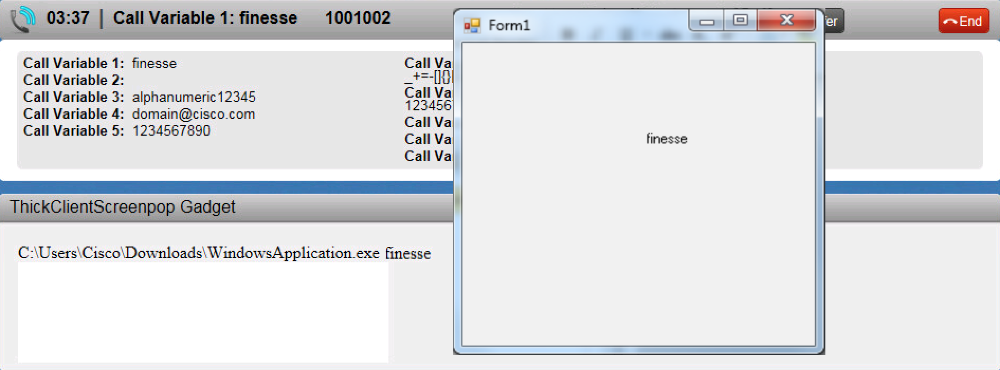

# Cisco Finesse - Thick Client Screen Pop Sample Gadget
The thick client screen pop sample gadget demonstrates to integrate a JavaApplet to allow a Windows command line to be invoked from a workflow action event. It is intended to serve as an example of passing a command line on a workflow action to be executed as a Windows command by using a JavaApplet in a Finesse gadget. The command can be used to run a Windows application such as the provided sample WindowsApplication.exe. This sample illustrates how to initialize the gadget, set up a handler for the workflow action event, and shows how to pass that to a applet which then invokes the command line passed on the workflowaction event. If the command line invoked is "WindowsApplication.exe <callvar1>" then callvar1 will be passed to the Windows application and displayed in the label.

This sample gadget contains the following files:

	FinesseJavaScriptLibrary/
		readme.txt
    JavaScreenPopApplet/
    	...
        JavaScreenPop.jar
    ThickClientScreenPop/
    	ThickClientScreenPop.css
        ThickClientScreenPop.js
        ThickClientScreenPop.xml
        WindowsApplication.exe
    WindowsApplication/
    	...
	_readme.txt
	ThickClientScreenPop.pdf

Download the version of the sample gadget that matches the Finesse version. Starting Finesse 11.0(1), sample gadgets will be forward compatible until compatibility is broken. At that time, a new version of the sample gadget will be published with the starting Finesse version number in the filename.

## Requirements
1. The sample gadget and the Finesse JavaScript library requires a deployment that includes Cisco Finesse. If you do not have a system that includes Cisco Finesse, you can reserve a [DevNet sandbox](https://developer.cisco.com/docs/finesse/#!sandbox) for developing your gadget.
1. A route point where the logged in agent is assigned to the queue.
2. A value in call variable used in the workflow. See the Usage section for more information.

## Usage
1. Read the document ThickClientScreenPop.pdf for an overview about this sample gadget as well as step-by-step instructions on how to modify and upload your gadget.
2. In the document, it also has step-by-step instructions on where to put the JavaScreenPop.jar as well as the WindowsApplication.exe

## Additional Information
##### Finesse REST API
Documentation for the Finesse REST API can be found in the [Finesse Developer Guide](https://developer.cisco.com/docs/finesse/#!rest-api-dev-guide).

##### Finesse JavaScript Library
Documentation for the Finesse JavaScript library can be found on [DevNet](https://developer.cisco.com/docs/finesse/#!javascript-library) and is also located on the Finesse server at the following URL: http(s)://&lt;FQDN&gt;:&lt;port&gt;/desktop/assets/js/doc/index.html

- You can access the JavaScript library at the following URL (starting Finesse 10.6(1)): http(s)://&lt;FQDN&gt;:&lt;port&gt;/desktop/assets/js/finesse.js.

 If you have third-party gadgets, the third-party gadgets can access the JavaScript library at: /desktop/assets/js/finesse.js.

- You can access JQuery at the following URL (starting Finesse 10.6(1)): http(s)://&lt;FQDN&gt;:&lt;port&gt;/desktop/assets/js/jquery.min.js.

 If you have third-party gadgets, the third-party gadgets can access JQuery at: /desktop/assets/js/jquery.min.js.

**For proper functioning of the JavaScript library, you must import both the JavaScript library and JQuery.**

## Disclaimer
This gadget is only a sample and is **NOT guaranteed to be bug free and production quality**.

The sample gadgets are meant to:
- Illustrate how to use the Finesse REST and JavaScript APIs
- Serve as an example of the step by step process of building a gadget using the Finesse JavaScript Library
- Provided as a guide for a developer to see how to initialize a gadget and set up handlers for user and dialog updates.

## Support Notice
[Support](http://developer.cisco.com/site/devnet/support) for the JavaScript library is provided on a "best effort" basis via DevNet. Like any custom deployment, it is the responsibility of the partner and/or customer to ensure that the customization works correctly and this includes ensuring that the Cisco Finesse JavaScript is properly integrated into 3rd party applications. Cisco reserves the right to make changes to the JavaScript code and corresponding API as part of the normal Cisco Finesse release cycle.

It is Cisco's intention to ensure JavaScript compatibility across versions as much as possible and Cisco will make every effort to clearly document any differences in the JavaScript across versions in the event that a backwards compatibility impacting change is made.

Cisco Systems, Inc. 
[http://www.cisco.com](http://www.cisco.com) 
[http://developer.cisco.com/site/finesse](http://developer.cisco.com/site/finesse)